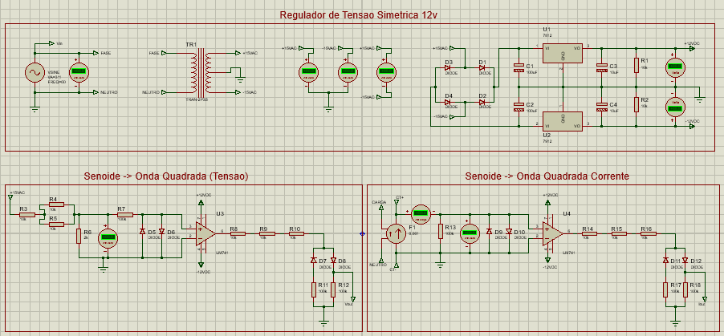

# Sobre  
Este projeto visa desenvolver um circuito com interface gráfica, baseada em arduino, para análise do consumo 
energético de cargas acopladas à ele.

# Cronograma  
 - Feito
      * Circuito para transformar senoide em onda quadrada (nível lógico alto e baixo, com Vp = 5V);  
      * Circuito regulador de tensão simétrica em 12V para alimentar os CIs;
 - Fazendo
      * Protótipo dos circuitos já desenvolvidos;  
 - À Fazer
      * ARDUINO: Voltímetro;  
      * ARDUINO: Amperímetro;  
      * ARDUINO: Fator de Potência + Potência Ativa + Potência Reativa + Potência Aparante;  
      * Decidir quais e quantas cargas serão acopladas (quantidade de plugs e tomadas);  
      * Estrutura de proteção para o circuito (acabamento);  
 
# Esquemático

